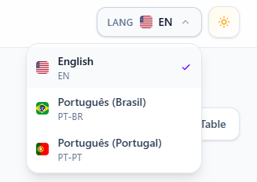
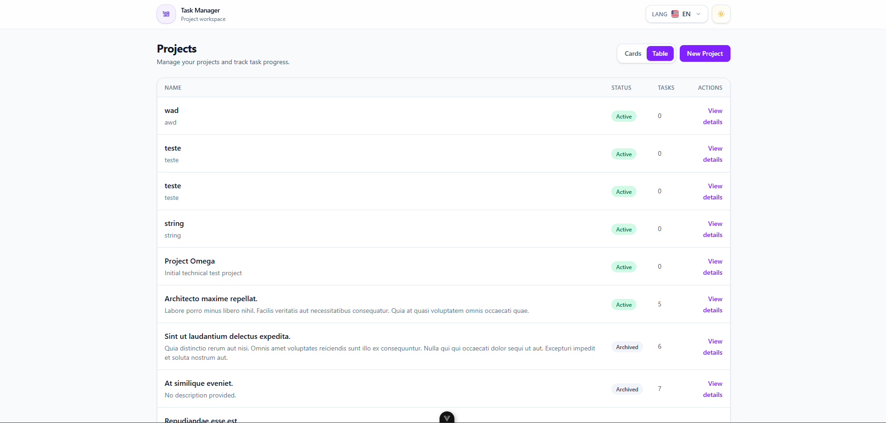
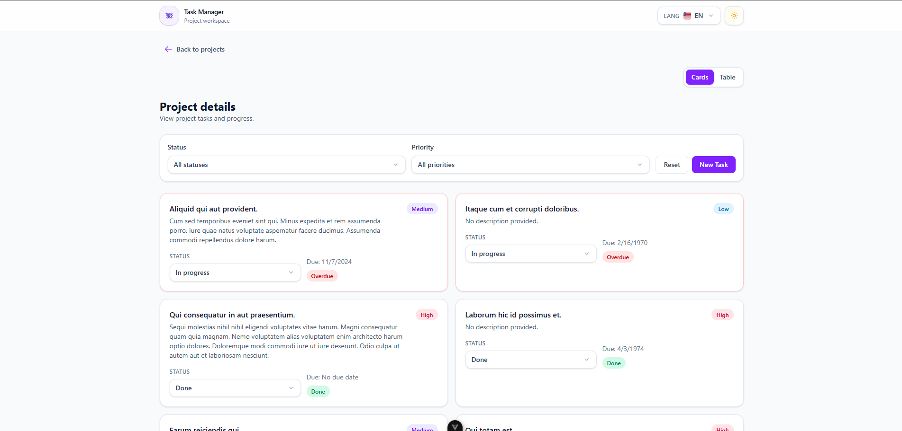
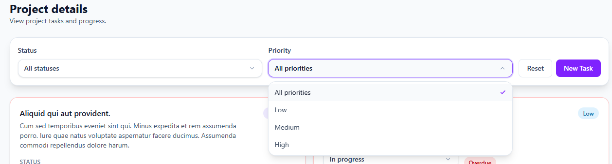

# Task Manager System

🌍 Leia em:
<a href="README.pt-BR.md"> Português (Brasil)</a>
<a href="README.pt-PT.md"> Português (Portugal)</a>
<a href="README.en.md"> English</a>

<p align="center">
  
</p>

<p align="center">
  A full stack workspace for managing projects, tasks, priorities, and delivery flow.
</p>

---

## Table of Contents

- [Overview](#overview)
- [Product Preview](#product-preview)
- [Key Features](#key-features)
- [Tech Stack](#tech-stack)
- [Engineering Decisions](#engineering-decisions)
- [Project Structure](#project-structure)
- [API Overview](#api-overview)
- [Local Setup](#local-setup)
- [Tests](#tests)
- [Project Organization](#project-organization)
- [Commit Convention](#commit-convention)
- [Current Scope](#current-scope)
- [Pending Improvements](#pending-improvements)
- [Final Notes](#final-notes)

---

## Overview

**Task Manager System** is a full stack application built to manage projects and tasks in a clear, structured, and scalable way.

It combines a Laravel API with a Vue 3 frontend to provide a modern workspace where users can:

- create and manage projects
- organize tasks by project
- filter work by status and priority
- track deadlines and overdue items
- interact with a responsive and reusable interface

The project was designed with strong emphasis on maintainability, reusable UI patterns, API consistency, and a clean developer experience for local setup and future evolution.

---

## Product Preview

This section is intended to showcase the main flows and interface quality of the application.






---

## Key Features

### Project management

- List projects with status and task count
- Create new projects from the interface
- Navigate from project list to project detail
- Support structured project organization in a simple workflow

### Task management

- View tasks by project
- Create new tasks
- Filter tasks by status and priority
- Update task status directly from the UI
- Highlight overdue tasks visually
- Support reusable task rendering patterns

### User experience

- Responsive layout
- Light and dark mode
- Multilingual interface
- Loading, empty, and error states
- Optimistic UI for task status updates
- Rollback handling on failed updates
- Reusable base components for consistency

---

## Tech Stack

### Backend

<p>
   Laravel 12<br/>
   PHP 8.5<br/>
   SQLite<br/>
   Composer<br/>
   PHPUnit / Laravel Testing
</p>

### Frontend

<p>
   Vue 3<br/>
   TypeScript<br/>
   Tailwind CSS 4<br/>
   Vite<br/>
   Axios<br/>
   Vitest
</p>

### Tooling and workflow

<p>
   Git<br/>
   GitHub<br/>
   Jira
</p>

---

## Engineering Decisions

### Laravel for API structure

Laravel was chosen for its expressive routing, request validation flow, Eloquent ORM, testing support, and clean separation between controllers, requests, resources, and models.

### SQLite for local portability

SQLite keeps the project lightweight and easy to run locally without depending on an external database service.

### Vue 3 with Composition API

The frontend uses Vue 3 with the Composition API to keep domain logic modular, reusable, and easier to scale as the application grows.

### Pinia for state management

Pinia was adopted to manage shared frontend state in a predictable and maintainable way, aligned with the modern Vue ecosystem.

### Reusable UI architecture

The frontend was structured around reusable base components to improve consistency across forms, filters, badges, modals, and interaction flows.

Examples include:

- `BaseButton`
- `BaseInput`
- `BaseTextarea`
- `BaseSelect`
- `BaseModal`
- `BaseBadge`

### Composables for domain logic

API interaction and stateful flows are encapsulated in composables such as:

- `useProjects()`
- `useTasks()`
- `useTheme()`
- `useLocale()`

This keeps view components cleaner and easier to maintain.

### Optimistic UI for task updates

Task status changes are reflected immediately in the interface and rolled back if the request fails, improving responsiveness while preserving data consistency.

### Internationalization support

The frontend is prepared for multilingual usage through Vue I18n and modular locale files.

---

## Project Structure

```bash
task-manager-system/
├── backend/    # Laravel API
├── frontend/   # Vue application
└── docs/       # Documentation assets and screenshots
```

### Backend responsibilities

- REST API endpoints
- validation
- database persistence
- business rules
- pagination and filtering
- seeding
- automated tests
- API documentation

### Frontend responsibilities

- routing and views
- API consumption
- reusable UI components
- composables and state handling
- theme and locale support
- project and task interaction flows

---

## API Overview

### Projects

- `GET /api/projects`
- `POST /api/projects`

### Tasks

- `GET /api/projects/{project}/tasks`
- `POST /api/projects/{project}/tasks`
- `PATCH /api/tasks/{task}`
- `DELETE /api/tasks/{task}`

### Filters

Example:

```bash
GET /api/projects/{project}/tasks?status=todo&priority=high
```

### API documentation

The backend includes API documentation through Scramble:

```bash
http://127.0.0.1:8000/docs/api
```

---

## Local Setup

### 1. Clone the repository

```bash
git clone https://github.com/viniciuslft/task-manager-system.git
cd task-manager-system
```

### 2. Backend setup

```bash
cd backend
composer install
cp .env.example .env
php artisan key:generate
php artisan migrate --seed
php artisan serve
```

Backend URL:

```bash
http://127.0.0.1:8000
```

### 3. Frontend setup

Open another terminal:

```bash
cd frontend
npm install
cp .env.example .env
npm run dev
```

Frontend URL:

```bash
http://127.0.0.1:5173
```

### Frontend environment variable

```env
VITE_API_BASE_URL=http://127.0.0.1:8000/api
```

### Expected local startup flow

#### Backend

```bash
cd backend
composer install
cp .env.example .env
php artisan key:generate
php artisan migrate --seed
php artisan serve
```

#### Frontend

```bash
cd frontend
npm install
cp .env.example .env
npm run dev
```

Once both servers are running, the application should work without additional manual configuration.

---

## Tests

### Backend tests

```bash
cd backend
php artisan test
```

### Frontend tests

```bash
cd frontend
npm run test:unit
```

---

## Project Organization

This project was developed with an organized delivery workflow, combining implementation tracking, acceptance criteria, and structured version history.

### Jira workflow

The project backlog and feature evolution were organized in **Jira**, helping track:

- epics
- development tasks
- acceptance criteria
- delivery progress
- implementation breakdown

This section is a good place to show how the work was structured from a project management perspective.

Recommended screenshots:

- Jira board overview
- completed epics
- sprint or backlog organization

Example:


### Public board link

[Jira Project Board](<https://taskmanagersystem.atlassian.net/>)

## Commit Convention

The repository follows a traceable commit naming convention that combines task identification, gitmoji, and clear action description.

[Gitmoji site](<https://gitmoji.dev/>)

```bash
TMS-171 | ✨ Implements BaseBadge Component
```

Other examples:

```bash
TMS-49 | ✨ Implement PATCH /api/tasks/{id}
TMS-60 | 🎨 Create TaskFactory
TMS-86 & TMS-87 | ✨ 🎨 🚀 Submit create project request and Refresh Project list
```

This improves readability of the Git history and helps connect code changes with work items.

---

## Current Scope

The current version includes:

- project listing
- project creation flow
- project detail page
- task listing by project
- task creation flow
- task filtering
- task status update with optimistic UI
- overdue task indication
- reusable base components
- responsive layout
- dark mode
- multilingual interface
- local setup with minimal configuration

---

## Pending Improvements

Possible future improvements include:

- project editing and archiving flows in the UI
- richer task editing experience
- delete actions exposed more broadly in the frontend
- stronger automated frontend test coverage
- accessibility refinements
- toast notification system for all success flows
- persisted view preferences
- board-style task interaction
- CI/CD pipeline for automated validation and deployment
- public deployment for live demonstration

---

## Final Notes

Task Manager System was built with a strong focus on:

- clean architecture
- reusable UI
- maintainability
- clarity of responsibilities
- scalable frontend and backend organization
- local setup simplicity
- structured engineering workflow

It provides a practical foundation for project and task management while remaining ready for future iterations and feature expansion.