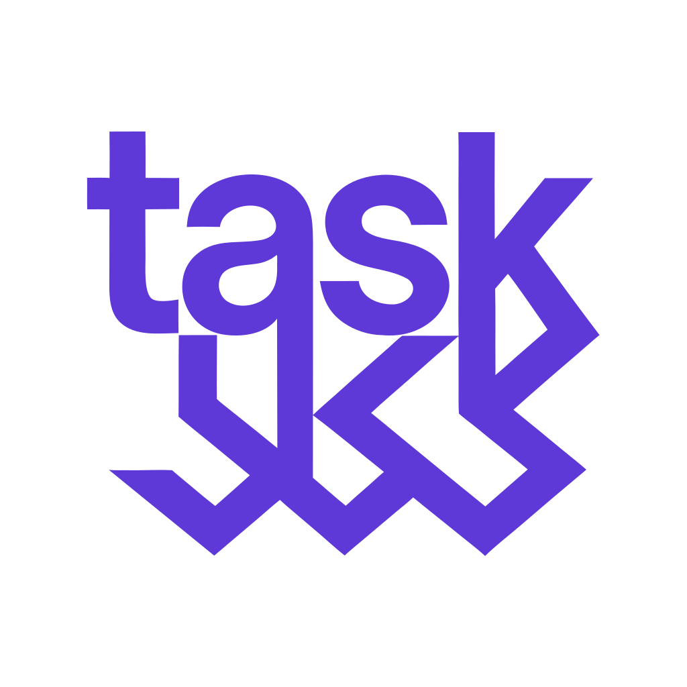
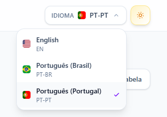
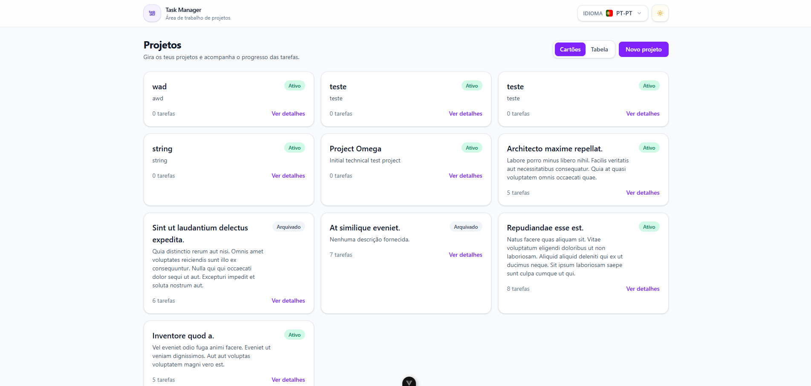
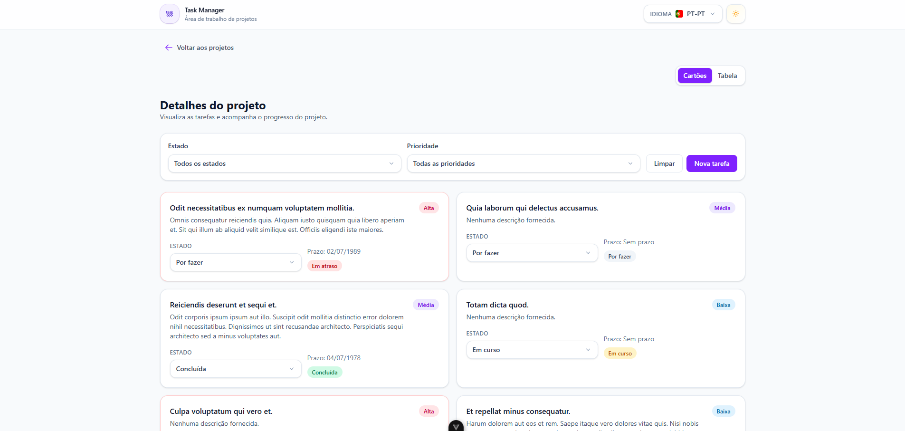
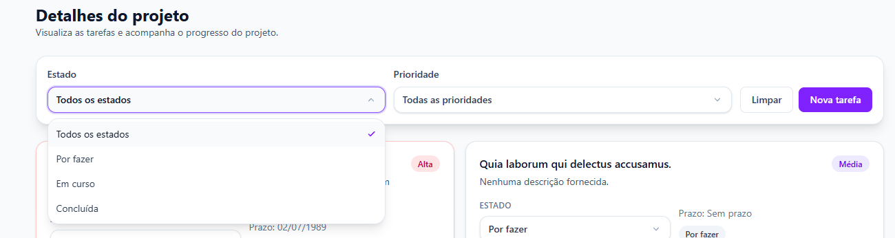
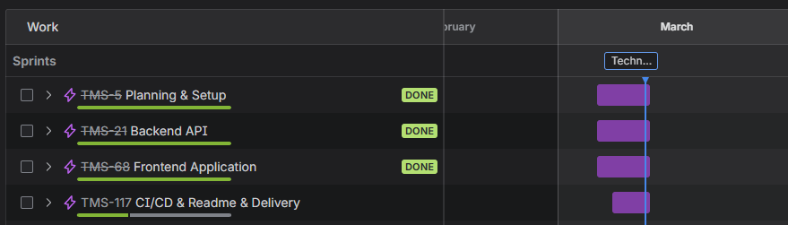

# Task Manager System

🌍 Leia em:
<a href="README.pt-BR.md"> Português (Brasil)</a>
<a href="README.pt-PT.md"> Português (Portugal)</a>
<a href="README.en.md"> English</a>

<p align="center">
  
</p>

<p align="center">
  Um workspace full stack para gerir projetos, tarefas, prioridades e fluxo de entrega.
</p>

---

## Índice

- [Visão Geral](#visão-geral)
- [Pré-visualização do Produto](#pré-visualização-do-produto)
- [Principais Funcionalidades](#principais-funcionalidades)
- [Stack Tecnológica](#stack-tecnológica)
- [Decisões de Engenharia](#decisões-de-engenharia)
- [Estrutura do Projeto](#estrutura-do-projeto)
- [Visão Geral da API](#visão-geral-da-api)
- [Configuração Local](#configuração-local)
- [Testes](#testes)
- [Organização do Projeto](#organização-do-projeto)
- [Convenção de Commits](#convenção-de-commits)
- [Âmbito Atual](#âmbito-atual)
- [Melhorias Futuras](#melhorias-futuras)
- [Notas Finais](#notas-finais)

---

## Visão Geral

**Task Manager System** é uma aplicação full stack desenvolvida para gerir projetos e tarefas de forma clara, estruturada e escalável.

Combina uma API em Laravel com um frontend em Vue 3 para disponibilizar um workspace moderno onde os utilizadores podem:

- criar e gerir projetos
- organizar tarefas por projeto
- filtrar trabalho por estado e prioridade
- acompanhar prazos e itens em atraso
- interagir com uma interface responsiva e reutilizável

O projeto foi desenvolvido com forte foco em manutenibilidade, padrões reutilizáveis de UI, consistência da API e uma boa experiência de desenvolvimento, tanto para configuração local como para evolução futura.

---

## Pré-visualização do Produto

Esta secção tem como objetivo apresentar os principais fluxos e a qualidade da interface da aplicação.






---

## Principais Funcionalidades

### Gestão de projetos

- Listagem de projetos com estado e contagem de tarefas
- Criação de novos projetos através da interface
- Navegação da lista de projetos para o detalhe do projeto
- Suporte a uma organização estruturada de projetos num fluxo simples

### Gestão de tarefas

- Visualização de tarefas por projeto
- Criação de novas tarefas
- Filtro de tarefas por estado e prioridade
- Atualização do estado da tarefa diretamente na interface
- Destaque visual para tarefas em atraso
- Suporte a padrões reutilizáveis de renderização de tarefas

### Experiência do utilizador

- Layout responsivo
- Tema claro e escuro
- Interface multilingue
- Estados de carregamento, vazio e erro
- Optimistic UI para atualização do estado das tarefas
- Rollback em caso de falha na atualização
- Componentes base reutilizáveis para manter consistência

---

## Stack Tecnológica

### Backend

<p>
   Laravel 12<br/>
   PHP 8.5<br/>
   SQLite<br/>
   Composer<br/>
   PHPUnit / Testes com Laravel
</p>

### Frontend

<p>
   Vue 3<br/>
   TypeScript<br/>
   Tailwind CSS 4<br/>
   Vite<br/>
   Axios<br/>
   Vitest
</p>

### Ferramentas e fluxo de trabalho

<p>
   Git<br/>
   GitHub<br/>
   Jira
</p>

---

## Decisões de Engenharia

### Laravel para a estrutura da API

Laravel foi escolhido pela sua roteirização expressiva, fluxo robusto de validação, ORM Eloquent, suporte a testes e separação clara entre controllers, requests, resources e models.

### SQLite para portabilidade local

SQLite mantém o projeto leve e fácil de executar localmente, sem depender de um serviço externo de base de dados.

### Vue 3 com Composition API

O frontend utiliza Vue 3 com Composition API para manter a lógica de domínio modular, reutilizável e mais fácil de escalar à medida que a aplicação evolui.

### Pinia para gestão de estado

Pinia foi adotado para gerir estado partilhado no frontend de forma previsível e de fácil manutenção, alinhado com o ecossistema moderno do Vue.

### Arquitetura de UI reutilizável

O frontend foi estruturado com componentes base reutilizáveis para melhorar a consistência entre formulários, filtros, badges, modais e fluxos de interação.

Exemplos:

- `BaseButton`
- `BaseInput`
- `BaseTextarea`
- `BaseSelect`
- `BaseModal`
- `BaseBadge`

### Composables para lógica de domínio

A interação com a API e os fluxos com estado foram encapsulados em composables como:

- `useProjects()`
- `useTasks()`
- `useTheme()`
- `useLocale()`

Isto mantém os componentes de visualização mais limpos e fáceis de manter.

### Optimistic UI para atualização de tarefas

As alterações de estado das tarefas são refletidas de imediato na interface e revertidas caso o pedido falhe, melhorando a responsividade sem comprometer a consistência dos dados.

### Suporte à internacionalização

O frontend está preparado para utilização multilingue com Vue I18n e ficheiros de locale modulares.

---

## Estrutura do Projeto

```bash
task-manager-system/
├── backend/    # API em Laravel
├── frontend/   # Aplicação em Vue
└── docs/       # Ficheiros de documentação e screenshots
```

### Responsabilidades do backend

- endpoints REST da API
- validação
- persistência em base de dados
- regras de negócio
- paginação e filtros
- seeders
- testes automatizados
- documentação da API

### Responsabilidades do frontend

- rotas e views
- consumo da API
- componentes reutilizáveis de UI
- composables e gestão de estado
- suporte a tema e idioma
- fluxos de interação de projetos e tarefas

---

## Visão Geral da API

### Projetos

- `GET /api/projects`
- `POST /api/projects`

### Tarefas

- `GET /api/projects/{project}/tasks`
- `POST /api/projects/{project}/tasks`
- `PATCH /api/tasks/{task}`
- `DELETE /api/tasks/{task}`

### Filtros

Exemplo:

```bash
GET /api/projects/{project}/tasks?status=todo&priority=high
```

### Documentação da API

O backend inclui documentação da API com Scramble:

```bash
http://127.0.0.1:8000/docs/api
```

---

## Configuração Local

### 1. Clonar o repositório

```bash
git clone https://github.com/viniciuslft/task-manager-system.git
cd task-manager-system
```

### 2. Configuração do backend

```bash
cd backend
composer install
cp .env.example .env
php artisan key:generate
php artisan migrate --seed
php artisan serve
```

URL do backend:

```bash
http://127.0.0.1:8000
```

### 3. Configuração do frontend

Abra outro terminal:

```bash
cd frontend
npm install
cp .env.example .env
npm run dev
```

URL do frontend:

```bash
http://127.0.0.1:5173
```

### Variável de ambiente do frontend

```env
VITE_API_BASE_URL=http://127.0.0.1:8000/api
```

### Fluxo esperado de arranque local

#### Backend

```bash
cd backend
composer install
cp .env.example .env
php artisan key:generate
php artisan migrate --seed
php artisan serve
```

#### Frontend

```bash
cd frontend
npm install
cp .env.example .env
npm run dev
```

Com ambos os servidores em execução, a aplicação deverá funcionar sem configuração manual adicional.

---

## Testes

### Testes do backend

```bash
cd backend
php artisan test
```

### Testes do frontend

```bash
cd frontend
npm run test:unit
```

---

## Organização do Projeto

Este projeto foi desenvolvido com um fluxo de entrega organizado, combinando rastreabilidade da implementação, critérios de aceitação e histórico de versão estruturado.

### Fluxo com Jira

O backlog e a evolução das funcionalidades foram organizados no **Jira**, ajudando a acompanhar:

- epics
- tarefas de desenvolvimento
- critérios de aceitação
- progresso da entrega
- detalhe da implementação

Esta secção é um bom local para mostrar como o trabalho foi estruturado do ponto de vista de gestão do projeto.

Screenshots recomendadas:

- visão geral do board no Jira
- epics concluídas
- organização da sprint ou backlog

Exemplo:



### Ligação pública do board

[Jira Project Board](<https://taskmanagersystem.atlassian.net/>)

## Convenção de Commits

O repositório segue uma convenção de commits rastreável que combina identificação da tarefa, gitmoji e uma descrição clara da ação realizada.

[Gitmoji site](<https://gitmoji.dev/>)

```bash
TMS-171 | ✨ Implements BaseBadge Component
```

Outros exemplos:

```bash
TMS-49 | ✨ Implement PATCH /api/tasks/{id}
TMS-60 | 🎨 Create TaskFactory
TMS-86 & TMS-87 | ✨ 🎨 🚀 Submit create project request and Refresh Project list
```

Isto melhora a legibilidade do histórico no Git e ajuda a ligar alterações de código aos itens de trabalho.

---

## Âmbito Atual

A versão atual inclui:

- listagem de projetos
- fluxo de criação de projetos
- página de detalhe do projeto
- listagem de tarefas por projeto
- fluxo de criação de tarefas
- filtros de tarefas
- atualização de estado com optimistic UI
- indicação visual de tarefas em atraso
- componentes base reutilizáveis
- layout responsivo
- tema escuro
- interface multilingue
- configuração local com requisitos mínimos

---

## Melhorias Futuras

Possíveis melhorias futuras incluem:

- fluxos de edição e arquivamento de projetos na UI
- experiência mais rica para edição de tarefas
- ações de eliminação mais expostas no frontend
- cobertura automatizada mais forte no frontend
- refinamentos de acessibilidade
- sistema de notificações toast para todos os fluxos de sucesso
- persistência da preferência de visualização
- interação em estilo board para tarefas
- pipeline de CI/CD para validação e deploy automatizados
- deploy público para demonstração ao vivo

---

## Notas Finais

Task Manager System foi desenvolvido com forte foco em:

- arquitetura limpa
- UI reutilizável
- manutenibilidade
- clareza de responsabilidades
- organização escalável entre frontend e backend
- simplicidade na configuração local
- fluxo de engenharia estruturado

Oferece uma base prática para gestão de projetos e tarefas, mantendo-se preparado para evoluções e novas funcionalidades.
